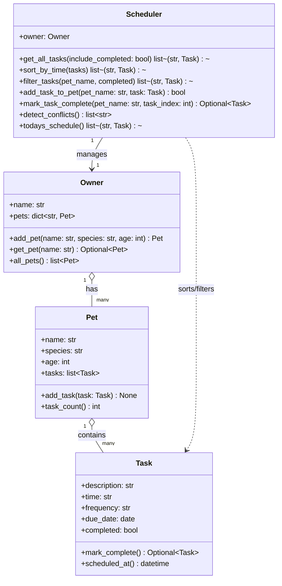

# PawPal+ Pet Care Scheduler

PawPal+ is a Streamlit app that helps a pet owner organize daily care tasks across multiple pets. The app uses a dedicated backend logic layer so scheduling behavior is testable and reusable outside the UI.

## Setup

1. Install dependencies: `pip install -r requirements.txt`
2. Run the app: `python -m streamlit run app.py`
3. Run CLI demo: `python main.py`

## Features

- Add and manage multiple pets from the UI.
- Schedule tasks by pet with date, time, and recurrence (`once`, `daily`, `weekly`).
- Sort tasks chronologically using scheduler logic.
- Filter tasks by pet and completion status.
- Mark tasks complete and auto-generate next occurrences for recurring tasks.
- Detect schedule conflicts and show warnings in the UI.

## Smarter Scheduling

The scheduler includes lightweight algorithmic helpers:

- **Sorting by time:** Uses task date + `HH:MM` to produce chronological views.
- **Filtering:** Narrows schedules by pet and/or completion state.
- **Recurring task automation:** Completing daily or weekly tasks creates a follow-up task at the next valid date.
- **Conflict detection:** Flags exact same date/time collisions across pets and tasks.

Tradeoff: conflict detection currently checks exact date/time matches only. It does not detect partial overlaps because tasks do not include durations.

## System Design (Mermaid UML)

## Testing PawPal+

Run all tests with:

`python -m pytest`

Current test coverage includes:

- Task completion state changes
- Task addition behavior
- Chronological sorting
- Daily recurrence generation
- Conflict detection for duplicate date/time tasks

Confidence Level: ★★★★☆ (4/5)

## Demo

