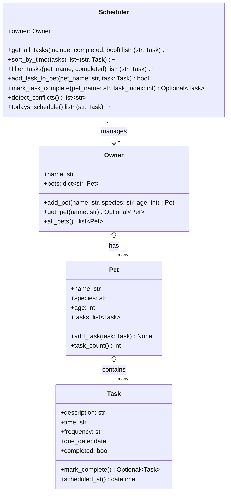

# Reflection: PawPal+ Build

## System Design

### Core user actions

1. A pet owner can add and manage multiple pets, each with basic profile information.
2. A pet owner can schedule care tasks (for example feeding, walks, or medication) with a date, time, and recurrence rule.
3. A pet owner can review today’s schedule in a clear, sorted list, then complete tasks and receive conflict warnings when tasks overlap.

### Building blocks (objects, attributes, methods)

1. **Task**
	 - Attributes: description, time, frequency, due_date, completed.
	 - Methods: `mark_complete()` to update status and create recurrence, `scheduled_at()` to support sorting.

2. **Pet**
	 - Attributes: name, species, age, tasks.
	 - Methods: `add_task()` and `task_count()`.

3. **Owner**
	 - Attributes: owner name, dictionary of pets.
	 - Methods: `add_pet()`, `get_pet()`, and `all_pets()`.

4. **Scheduler**
	 - Attributes: reference to one Owner.
	 - Methods: `get_all_tasks()`, `sort_by_time()`, `filter_tasks()`, `add_task_to_pet()`, `mark_task_complete()`, `detect_conflicts()`, `todays_schedule()`.

### UML (Mermaid)

## 1a. Initial design

My initial design used four classes with clear boundaries: `Task` as the atomic unit of work, `Pet` as the owner of tasks, `Owner` as the manager of pets, and `Scheduler` as the orchestrator for sorting and querying. This helped keep the UI thin and focused on input/output while all rules lived in backend methods. I intentionally used dataclasses for `Task` and `Pet` because they are mostly structured data with a few helper behaviors. The `Scheduler` acts as the system brain and keeps multi-pet operations in one place.

## 1b. Design changes

I originally planned to keep recurrence logic inside `Scheduler`, but moved task cloning into `Task.mark_complete()` so the rule is attached to the object that knows its own frequency. I also added a `due_date` field instead of only `time`, because recurrence and sorting are cleaner when date and time are explicit. Another change was adding `Scheduler.add_task_to_pet()` so UI code does not directly mutate nested collections. These changes reduced coupling and made tests easier to write.

## 2b. Tradeoffs

The conflict detector currently flags only exact date/time collisions. This is simple and fast, but it does not capture partial overlap (for example one long task that spans two short tasks) because tasks do not track duration. I kept this lightweight behavior to avoid premature complexity in the first implementation. If needed later, the model can add task duration and use interval overlap checks.

## AI Strategy Reflection

The most effective Copilot-assisted patterns were generating class skeletons quickly, drafting test cases for each behavior, and filling repetitive UI wiring code between form inputs and backend methods. One suggestion I modified was an over-abstracted scheduler interface that introduced unnecessary helper layers; I kept a simpler API to preserve readability for a learning project. Using separate chat sessions by phase was useful because architecture, algorithms, and testing each had different goals and constraints. The main lesson was that AI is fast at scaffolding, but I still needed to be the lead architect deciding boundaries, complexity level, and which suggestions to reject.
